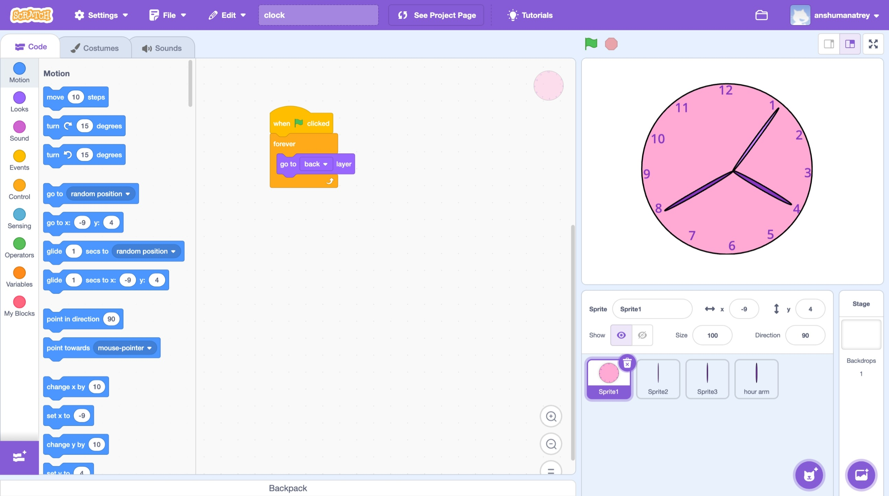

## File Naming and Description Instructions

Please ensure that you add the file names of any Python and Scratch files you create, along with a brief description of what each file is about. This will help in maintaining clarity and organization within the project.

`clock.sb3`: This file includes a Scratch project that demonstrates a clock animation.

